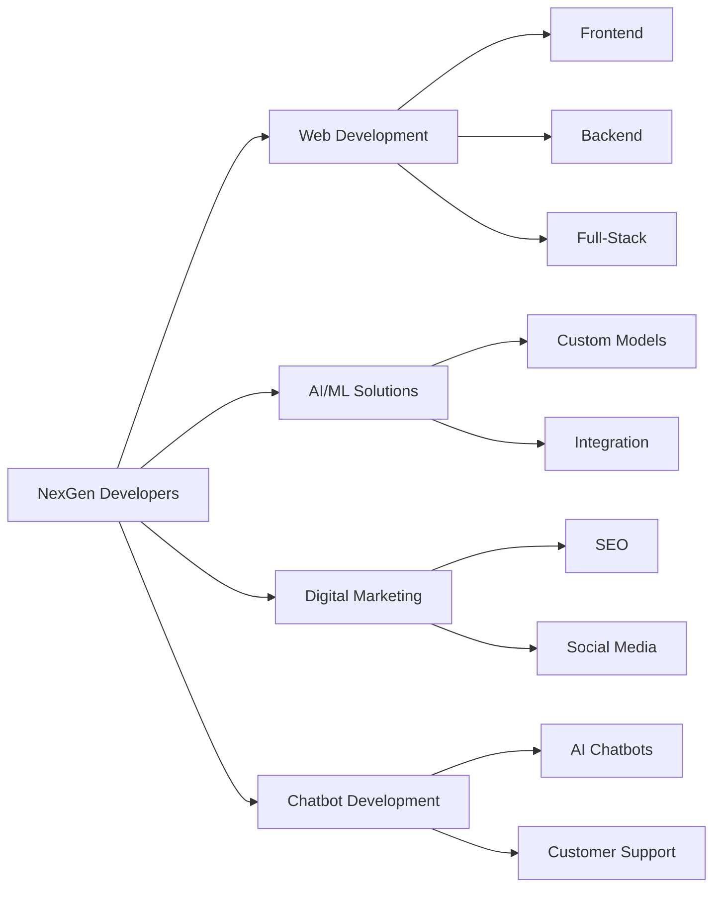

<div align="center">
  
#  Hi there, I'm Umar Nazir


[](https://umarnazir.vercel.app)
[](https://linkedin.com/in/umar-nazir19)
[](mailto:erumarnazir@gmail.com)

</div>

---

## 👨‍💻 About Me

```typescript
const umarNazir = {
    role: "Software Developer & Frontend Engineer",
    company: "Saibbyweb",
    founder: "NexGen Developers",
    education: "Computer Science Engineer",
    experience: "2+ years",
    location: "Delhi, India",
    
    currentFocus: [
        "Building scalable web applications",
        "Leading development teams",
        "Driving digital transformation"
    ],
    
    funFact: "I turn coffee ☕ into code and ideas into digital reality! 🚀"
};
```

I'm a passionate **Software Developer** specializing in creating efficient, scalable, and user-centric web solutions. With over **2 years of professional experience**, I combine technical expertise with business acumen to deliver impactful digital products.

As the **Founder & CEO of NexGen Developers**, I lead a talented team of freelancers providing comprehensive solutions including Full-Stack Development, AI/ML Models, Chatbot Solutions, and Digital Marketing services.

---

## 🛠️ Tech Stack

### **Frontend Development**
<p>
  
</p>

### **Backend Development**
<p>
  
</p>

### **Database & APIs**
<p>
  
</p>

### **DevOps & Tools**
<p>
  
</p>

### **Additional Skills**
- **SEO & Digital Marketing:** Technical SEO, On-Page/Off-Page Optimization, Google Analytics, Search Console
- **APIs:** REST APIs, GraphQL, API Integration & Development
- **Testing:** Jest, React Testing Library
- **Version Control:** Git, GitHub, GitLab
- **Agile Methodologies:** Scrum, Kanban

---

## 📊 GitHub Statistics

<div align="center">
  
  
</div>

<div align="center">
  
</div>

---

## 🚀 Featured Projects

<table>
<tr>
<td width="50%" valign="top">

### 🌟 [Kindness Towards Humanity](https://kindnesstowardshumanity.in)

A comprehensive NGO platform dedicated to serving underprivileged communities through welfare and education programs.

**Tech Stack:**
- React.js
- Tailwind CSS
- SEO Optimized
- Responsive Design

**Impact:** Empowering communities with accessible resources

</td>
<td width="50%" valign="top">

### 💼 [NexGen Developers](https://github.com/umarnazir/NexGen-Developers)

Full-service freelance platform offering AI/ML solutions, chatbot development, web development, and digital marketing.

**Tech Stack:**
- Full-Stack Development
- AI/ML Integration
- GraphQL APIs
- Cloud Solutions

**Services:** 360° Digital Solutions

</td>
</tr>
<tr>
<td width="50%" valign="top">

### 🏢 Office Management System

Enterprise-grade office management solution streamlining operations and boosting productivity.

**Tech Stack:**
- React.js
- Node.js
- MySQL
- REST APIs

**Features:** Task Management, Employee Tracking, Analytics

</td>
<td width="50%" valign="top">

### 🏨 Hotel Sea View

Modern hotel booking and management platform with seamless user experience and real-time availability.

**Tech Stack:**
- Next.js
- TypeScript
- Tailwind CSS
- Firebase

**Features:** Real-time Booking, Payment Integration, Admin Dashboard

</td>
</tr>
</table>

---

## 💼 Professional Experience

### 🔹 Software Developer @ Saibbyweb
*2022 - Present*
- Developing scalable web applications using React.js and Next.js
- Implementing SEO strategies resulting in improved search rankings
- Collaborating with cross-functional teams to deliver client projects

### 🔹 Founder & CEO @ NexGen Developers
*2023 - Present*
- Leading a team of skilled developers and designers
- Managing end-to-end project delivery
- Driving business growth through innovative solutions

---

## 🎯 Services I Offer



---

## 📈 SEO & Digital Marketing Expertise

- 🎯 **Technical SEO:** Site Speed Optimization, Schema Markup, Core Web Vitals
- 🔍 **On-Page SEO:** Keyword Research, Content Optimization, Meta Tags
- 🔗 **Off-Page SEO:** Link Building, Social Signals, Brand Mentions
- 📊 **Analytics:** Google Analytics, Search Console, Performance Tracking
- 💡 **Strategy:** Content Marketing, Conversion Rate Optimization

---

## 🏆 Achievements

- ⭐ Successfully delivered **20+ client projects**
- 🚀 Improved client website traffic by **150%** through SEO optimization
- 👥 Built and managed a team of **10+ freelance professionals**
- 💼 Established NexGen Developers as a trusted software solutions provider

---

## 📫 Let's Connect & Collaborate

<div align="center">

[](https://umarnazir.vercel.app)
[](https://linkedin.com/in/umar-nazir19)
[](mailto:erumarnazir@gmail.com)
[](https://github.com/umarnazir)

### 💬 Open to:
**Freelance Projects** • **Collaboration** • **Job Opportunities** • **Consulting**

</div>

---

<div align="center">

### ⚡ "Code is like humor. When you have to explain it, it's bad." – Cory House


</div>
